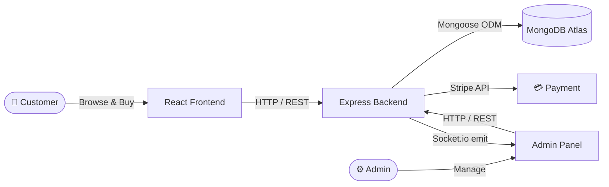

<div align="center">

# 🌱 Kumar Fertilizer Shop

**A full-stack MERN e-commerce platform for farmers and gardening enthusiasts**

[](https://github.com/priyanshuuranjan/Fertilizer-Shop-admin/actions/workflows/ci.yml)
[](https://nodejs.org)
[](https://react.dev)
[](https://www.mongodb.com/atlas)
[](https://stripe.com)
[](LICENSE)

**[🛒 Customer Site](https://kumarfertilizer.onrender.com)** · **[⚙️ Admin Panel](https://fertilizer-shop-admin-backend.onrender.com)** · **[🐛 Report Bug](https://github.com/priyanshuuranjan/Fertilizer-Shop-admin/issues)**

</div>

---

## 📖 Project Overview

Three independent apps working together:

| App | Folder | Role |
|-----|--------|------|
| 🛒 **Customer Frontend** | `frontend/` | Browse products, cart, Stripe checkout |
| ⚙️ **Admin Panel** | `admin/` | Manage products, orders, customers, dashboard |
| 🖥️ **Backend API** | `backend/` | REST API — auth, database, payments, real-time events |

---

## 📑 Table of Contents

- [Features](#-features)
- [Tech Stack](#️-tech-stack)
- [Project Structure](#-project-structure)
- [Architecture & Flows](#️-architecture--flows)
- [CI/CD Pipeline](#-cicd-pipeline)
- [Getting Started](#-getting-started)
- [Environment Variables](#-environment-variables)
- [API Reference](#-api-reference)
- [Load Balancing — PM2](#-load-balancing--pm2)
- [Deployment](#-deployment)
- [License](#-license)

---

## 🚀 Features

### 🛒 Customer Frontend
- Product browsing with category filters (Fertilizer, Seeds, Fungicides, Herbicide, Nutrients, Farm Machinery)
- JWT-based registration & login
- Cart — add/remove, live quantity & total
- Promo code / discount support at checkout
- Stripe payment gateway (test mode)
- Order history with real-time status tracking
- Skeleton shimmer loaders on every async screen
- Fully responsive (mobile-first)

### ⚙️ Admin Panel *(Login protected)*
- **📊 Dashboard** — Revenue cards, 7-day bar chart (Recharts), recent orders table
- **➕ Add Product** — Image upload, name, price, size, category, stock quantity
- **📋 Product List** — Checkbox bulk-select, bulk delete, individual delete
- **📦 Orders** — All orders, status update (Processing → Shipped → Delivered), **CSV Export**
- **👥 Customers** — All users with order count & total spent, search & sort
- **🎟️ Promo Codes** — Create & manage discount codes
- **🔔 Real-time Notifications** — Bell badge via Socket.io (new orders ping instantly, no page refresh)
- **🌙 Dark / Light Mode** — persisted in `localStorage`
- Responsive sidebar → horizontal navbar on mobile

### 🖥️ Backend API
- RESTful API — Express + MongoDB/Mongoose
- JWT authentication (stateless — no server sessions)
- Rate limiting — 200 req / 15 min per IP
- Request logging — Morgan + Winston (saved to `logs/`)
- Centralized error handling middleware
- Socket.io server — real-time order broadcast
- Multer — product image uploads
- Stripe checkout session + payment verification

---

## 🛠️ Tech Stack

### Backend
| Technology | Version | Why |
|-----------|---------|-----|
| Node.js | v20+ | Fast JS runtime — single language across the full stack |
| Express.js | v4.21 | Clean routing + middleware chaining |
| MongoDB + Mongoose | v8.9 | Flexible NoSQL — perfect for variable product schemas |
| JWT | v9 | Stateless auth — no session storage, scales horizontally |
| Bcrypt | v5.1 | One-way password hashing — safe even on DB leak |
| Stripe | v17.5 | PCI-compliant payments, no card data ever stored |
| Socket.io | v4 | WebSocket bi-directional communication for real-time events |
| Multer | v1.4 | Multipart form file uploads |
| express-rate-limit | latest | DDoS / brute-force protection |
| Morgan + Winston | latest | HTTP request logs + structured file-based logging |

### Frontend / Admin
| Technology | Version | Why |
|-----------|---------|-----|
| React | v18.3 | Component-based UI, Virtual DOM, industry standard |
| Vite | v6.0 | 10× faster than CRA, instant HMR |
| React Router DOM | v6.28 | Client-side SPA routing |
| Axios | v1.7 | HTTP client with interceptors — cleaner than fetch |
| Recharts | latest | Composable charts for the dashboard |
| Socket.io-client | latest | Real-time order notification events |
| React Toastify | v11 | Toast notifications |

### DevOps / Infrastructure
| Tool | Purpose |
|------|---------|
| GitHub Actions | CI — auto build-check on every push, every branch |
| Render.com | CD — auto-deploy to production on master merge |
| PM2 | Load balancer — cluster mode across all CPU cores |
| MongoDB Atlas | Managed cloud database — auto-backup, 99.9% uptime |

---

## 📂 Project Structure

```
Fertilizer-Shop-admin/
│
├── 📁 backend/                         ← Express REST API
│   ├── server.js                       ← Entry point (HTTP + Socket.io server)
│   ├── config/
│   │   └── db.js                       ← MongoDB Atlas connection
│   ├── controllers/                    ← Business logic
│   │   ├── productController.js        ← Add / list / remove / bulk-remove
│   │   ├── orderController.js          ← Place / verify / list / export CSV
│   │   ├── userController.js           ← Register / login
│   │   ├── cartController.js
│   │   ├── promoController.js          ← Promo code validate & burn
│   │   ├── dashboardController.js      ← Stats + 7-day chart data
│   │   ├── customerController.js       ← Users with order stats
│   │   └── adminController.js          ← Admin login
│   ├── middleware/
│   │   ├── auth.js                     ← JWT verify middleware
│   │   ├── rateLimiter.js              ← 200 req / 15 min per IP
│   │   ├── logger.js                   ← Morgan + Winston
│   │   └── errorHandler.js             ← Centralized error responses
│   ├── models/
│   │   ├── productModel.js             ← name, price, size, category, stock
│   │   ├── orderModel.js               ← userId, items[], amount, status
│   │   ├── userModel.js                ← name, email, password, cartData
│   │   └── promoModel.js
│   ├── routes/
│   │   ├── productRoute.js
│   │   ├── orderRoute.js
│   │   ├── userRoute.js
│   │   ├── cartRoute.js
│   │   ├── promoRoute.js
│   │   ├── adminRoute.js
│   │   ├── dashboardRoute.js           ← GET /api/dashboard/stats
│   │   └── customerRoute.js            ← GET /api/customers/list
│   └── uploads/                        ← Served as static at /images
│
├── 📁 admin/                           ← Admin Panel (React + Vite)
│   └── src/
│       ├── App.jsx                     ← Routes + token state
│       ├── components/
│       │   ├── Navbar/                 ← Dark/light toggle + bell notification
│       │   ├── Sidebar/                ← Dashboard, List, Orders, Customers links
│       │   ├── Login/                  ← Admin login form
│       │   └── Skeleton/               ← Shimmer loader components
│       └── pages/
│           ├── Dashboard/              ← Stat cards + Recharts bar chart
│           ├── Add/                    ← Product form with image upload
│           ├── List/                   ← Products + bulk-delete checkboxes
│           ├── Orders/                 ← Orders + status + CSV export
│           ├── Customers/              ← User table with search & sort
│           └── PromoCode/              ← Discount code management
│
├── 📁 frontend/                        ← Customer Storefront (React + Vite)
│   └── src/
│       ├── context/StoreContext.jsx    ← Global state (cart, auth, products)
│       ├── components/                 ← Navbar, ProductItem, ExploreMenu…
│       └── pages/                      ← Home, Cart, PlaceOrder, MyOrders, Verify
│
├── 📁 .github/workflows/
│   └── ci.yml                          ← GitHub Actions CI pipeline
│
├── ecosystem.config.cjs                ← PM2 cluster mode config
└── README.md
```

---

## 🏗️ Architecture & Flows

### System Overview



### Request Lifecycle

```
React (Frontend / Admin)
        │
        │  HTTP Request  (e.g. GET /api/product/list)
        ▼
┌────────────────────────────────────────┐
│            Express Server              │
│                                        │
│  1. cors()           ← allow origins   │
│  2. rateLimiter      ← max 200/15 min  │
│  3. morganMiddleware ← log request     │
│  4. express.json()   ← parse body      │
│                                        │
│  Router  →  productRoute.js            │
│       ↓                                │
│  Controller  →  listProduct()          │
│       ↓                                │
│  Mongoose  →  productModel.find({})    │
│       ↓                                │
│  MongoDB Atlas  (cloud query)          │
│       ↓                                │
│  Response: { success: true, data: [] } │
└────────────────────────────────────────┘
        │
        ▼
React  →  setList(data)  →  UI re-renders
```

### JWT Authentication Flow

```
User submits email + password
        │
        ▼
POST /api/user/login
        │
        ▼
bcrypt.compare(inputPassword, storedHash)
        │
        ├── ❌ Mismatch  →  401 Unauthorized
        │
        └── ✅ Match  →  jwt.sign({ id: user._id }, JWT_SECRET, { expiresIn: '7d' })
                               │
                               ▼
                    Token returned to client
                               │
                               ▼
                localStorage.setItem('token', token)
                               │
                Every future request → headers: { token }
                               │
                               ▼
                auth middleware → jwt.verify(token, JWT_SECRET)
                               │
                    ├── ❌ Invalid / Expired  →  401
                    └── ✅ Valid  →  req.body.userId = decoded.id  →  next()
```

### Real-Time Order Notification (Socket.io)

```
Customer places order (frontend)
        │
        ▼
POST /api/order/place  (backend)
        │
        ├── Save new order to MongoDB
        ├── Create Stripe checkout session
        └── io.emit('newOrder', { orderId, amount, customerName })
                │
                ▼
        Socket.io broadcasts to ALL connected admin clients
                │
                ▼
        Admin Panel — Navbar.jsx
        socket.on('newOrder')  →  setNotifCount(prev + 1)
                │
                ▼
        🔔 Bell badge updates INSTANTLY — zero page refresh
```

---

## 🔄 CI/CD Pipeline

### Full Pipeline Flow

```
Developer pushes code
        │
        ▼
GitHub Repository
        │   ← webhook fires automatically
        ▼
┌──────────────────────────────────────────────────────────┐
│               GitHub Actions CI Runner                    │
│                   (Ubuntu Linux VM — free)                │
│                                                           │
│   ┌──────────────────┐   ┌────────────────────────────┐  │
│   │  Backend Check   │   │   Admin Frontend Build     │  │
│   │                  │   │                            │  │
│   │  ✓ checkout      │   │  ✓ checkout                │  │
│   │  ✓ Node.js 20    │   │  ✓ Node.js 20              │  │
│   │  ✓ npm ci        │   │  ✓ npm ci                  │  │
│   └──────────────────┘   │  ✓ vite build              │  │
│                           │  ✓ upload dist artifact    │  │
│   ┌──────────────────┐   └────────────────────────────┘  │
│   │  Frontend Build  │                                    │
│   │  ✓ npm ci        │   ← all 3 jobs run in parallel    │
│   │  ✓ vite build    │                                    │
│   └──────────────────┘                                    │
└──────────────────────────────────────────────────────────┘
        │
        ├── ❌ Any job fails → RED ✗ on GitHub → deploy blocked → fix & re-push
        │
        └── ✅ All pass → merge PR to master
                │
                ▼
        Render.com detects master branch update
                │
        ┌───────┴────────────┐
        ▼                    ▼
   Backend               Frontend / Admin
   auto-deploys          auto-deploys
   node server.js        static site (dist/)
        │                    │
        ▼                    ▼
   🚀 LIVE API          🚀 LIVE Site
```

### Workflow File — `.github/workflows/ci.yml`

```yaml
name: CI

on:
  push:
    branches: ["**"]        # runs on every branch push
  pull_request:
    branches: [master]      # runs on every PR targeting master

jobs:
  build-backend:
    runs-on: ubuntu-latest
    steps:
      - uses: actions/checkout@v4
      - uses: actions/setup-node@v4
        with:
          node-version: "20"
          cache: "npm"
          cache-dependency-path: backend/package-lock.json
      - run: npm ci
        working-directory: backend

  build-admin:
    runs-on: ubuntu-latest
    steps:
      - uses: actions/checkout@v4
      - uses: actions/setup-node@v4
        with:
          node-version: "20"
          cache: "npm"
          cache-dependency-path: admin/package-lock.json
      - run: npm ci
        working-directory: admin
      - run: npm run build
        working-directory: admin
        env:
          VITE_API_URL: http://localhost:8000
      - uses: actions/upload-artifact@v4
        with:
          name: admin-dist
          path: admin/dist
          retention-days: 3

  build-frontend:
    runs-on: ubuntu-latest
    steps:
      - uses: actions/checkout@v4
      - uses: actions/setup-node@v4
        with:
          node-version: "20"
          cache: "npm"
          cache-dependency-path: frontend/package-lock.json
      - run: npm ci
        working-directory: frontend
      - run: npm run build
        working-directory: frontend
        env:
          VITE_API_URL: http://localhost:8000
```

> **Why `npm ci` and not `npm install`?**
> `npm ci` installs the exact versions locked in `package-lock.json` — reproducible builds every time. `npm install` can silently upgrade minor versions and cause environment drift.

---

## 🚀 Getting Started

### Prerequisites
- **Node.js** ≥ 18
- A [MongoDB Atlas](https://www.mongodb.com/atlas) account (free tier works)
- A [Stripe](https://stripe.com) account — test keys are enough

### 1 — Clone

```bash
git clone https://github.com/priyanshuuranjan/Fertilizer-Shop-admin.git
cd Fertilizer-Shop-admin
```

### 2 — Environment Variables

Create the `.env` files shown in the [Environment Variables](#-environment-variables) section.

### 3 — Run all three apps

Open **3 terminals**:

```bash
# Terminal 1 — Backend
cd backend && npm install && npm run server

# Terminal 2 — Customer Frontend
cd frontend && npm install && npm run dev

# Terminal 3 — Admin Panel
cd admin && npm install && npm run dev
```

| App | Local URL |
|-----|-----------|
| Backend API | `http://localhost:8000` |
| Customer Site | `http://localhost:5173` |
| Admin Panel | `http://localhost:5174` |

---

## 🔐 Environment Variables

> ⚠️ `.env` files are git-ignored. **Never commit real secrets.**

**`backend/.env`**
```env
PORT=8000
MONGODB_URL=mongodb+srv://<user>:<password>@<cluster>/<dbname>
JWT_SECRET=your_random_secret_here
STRIPE_SECRET_KEY=sk_test_xxxxxxxxxxxxxxxxxxxx
FRONTEND_URL=http://localhost:5173
ADMIN_EMAIL=admin@yourshop.com
ADMIN_PASSWORD=YourSecurePassword
```

**`frontend/.env`**
```env
VITE_API_URL=http://localhost:8000
```

**`admin/.env`**
```env
VITE_API_URL=http://localhost:8000
```

> In production, set `VITE_API_URL` to your deployed backend URL and `FRONTEND_URL` to your deployed storefront URL.

---

## 🔌 API Reference

Base URL: `http://localhost:8000`

### Products — `/api/product`
| Method | Endpoint | Body | Description |
|--------|----------|------|-------------|
| `POST` | `/add` | `multipart/form-data` — name, description, price, size, category, stock, image | Add a product |
| `GET` | `/list` | — | All products |
| `POST` | `/remove` | `{ id }` | Delete one product |
| `POST` | `/bulk-remove` | `{ ids: [] }` | Delete multiple products |

### Users — `/api/user`
| Method | Endpoint | Body | Description |
|--------|----------|------|-------------|
| `POST` | `/register` | `{ name, email, password }` | Register → returns JWT |
| `POST` | `/login` | `{ email, password }` | Login → returns JWT |

### Orders — `/api/order`
| Method | Endpoint | Auth | Description |
|--------|----------|------|-------------|
| `POST` | `/place` | ✅ JWT | Create order + Stripe checkout session |
| `POST` | `/verify` | — | Confirm Stripe payment result |
| `POST` | `/userorders` | ✅ JWT | Logged-in user's own orders |
| `GET` | `/list` | — | All orders (admin) |
| `POST` | `/status` | — | Update order status |
| `GET` | `/export` | — | Download all orders as CSV |

### Cart — `/api/cart` *(JWT required)*
| Method | Endpoint | Body | Description |
|--------|----------|------|-------------|
| `POST` | `/add` | `{ itemId }` | Add item to cart |
| `POST` | `/remove` | `{ itemId }` | Decrease / remove item |
| `POST` | `/get` | — | Get user's cart |

### Dashboard & Customers
| Method | Endpoint | Description |
|--------|----------|-------------|
| `GET` | `/api/dashboard/stats` | Revenue, orders, users, products, 7-day chart data |
| `GET` | `/api/customers/list` | All users with order count + total spent |

### Admin & Promo
| Method | Endpoint | Description |
|--------|----------|-------------|
| `POST` | `/api/admin/login` | Admin JWT token |
| `GET` | `/api/promo/list` | All promo codes |
| `POST` | `/api/promo/add` | Create promo code |
| `POST` | `/api/promo/validate` | Validate at checkout |
| `POST` | `/api/promo/remove` | Delete promo code |

### Static Files
| Method | Endpoint | Description |
|--------|----------|-------------|
| `GET` | `/images/:filename` | Serve uploaded product image |

> 🔑 Protected routes require the JWT in a `token` request header.

---

## ⚡ Load Balancing — PM2

Node.js is single-threaded — only **1 CPU core** used by default.
PM2 cluster mode starts **one process per CPU core** → full utilisation.

```
Without PM2:  [Core 1: Node.js]  [Core 2: idle]  [Core 3: idle]  [Core 4: idle]

With PM2:     [Core 1: Node.js]  [Core 2: Node.js]  [Core 3: Node.js]  [Core 4: Node.js]
                    ↑                  ↑                   ↑                   ↑
               Process 1          Process 2           Process 3           Process 4
                    └──────────────── PM2 Round-Robin Distribution ───────────────┘
                                   4× throughput · auto-restart on crash
```

```bash
npm install -g pm2

pm2 start ecosystem.config.cjs   # start cluster (reads ecosystem.config.cjs)
pm2 status                        # view all processes
pm2 logs                          # live logs
pm2 reload all                    # zero-downtime redeploy
pm2 save && pm2 startup           # persist across server reboots
```

---

## 🔒 Security Overview

| Layer | Mechanism | Detail |
|-------|-----------|--------|
| Passwords | Bcrypt | 10 salt rounds — one-way hash, irreversible |
| Authentication | JWT | Stateless, 7-day expiry, signed with secret |
| Rate Limiting | express-rate-limit | 200 req / 15 min per IP (API) |
| Payments | Stripe | PCI-compliant — card data never touches our server |
| Cross-Origin | CORS | Only whitelisted origins accepted |
| Error leakage | Centralized handler | Stack traces never sent to client |

---

## 🌐 Deployment — Render.com

### Backend (Web Service)

| Setting | Value |
|---------|-------|
| Root Directory | `backend` |
| Build Command | `npm install` |
| Start Command | `node server.js` |
| Auto-Deploy | ✅ Yes — from `master` |

Copy all keys from `backend/.env` into Render's **Environment** tab.

### Admin Panel (Static Site)

| Setting | Value |
|---------|-------|
| Root Directory | `admin` |
| Build Command | `npm install && npm run build` |
| Publish Directory | `dist` |
| Auto-Deploy | ✅ Yes — from `master` |
| Env Var | `VITE_API_URL` = deployed backend URL |

### Customer Frontend (Static Site)

Same as Admin Panel — root directory = `frontend`.

> **Free tier note:** Render spins down idle services after ~15 min.
> First request after sleep takes ~30 s (cold start). Skeleton loaders keep the UI graceful during this wait.
> Use [UptimeRobot](https://uptimerobot.com) (free) to ping your API every 5 min and eliminate cold starts.

---

## 📜 Available Scripts

| App | Command | Description |
|-----|---------|-------------|
| `backend` | `npm run server` | Start API with nodemon (hot reload) |
| `frontend` | `npm run dev` | Vite dev server |
| `frontend` | `npm run build` | Production build |
| `frontend` | `npm run preview` | Preview production build |
| `frontend` | `npm run lint` | ESLint |
| `admin` | `npm run dev` | Vite dev server |
| `admin` | `npm run build` | Production build |
| `admin` | `npm run preview` | Preview production build |

---

## 📄 License

Licensed under the **MIT License** — see [LICENSE](LICENSE) for details.

---

## 📞 Contact

**Priyanshu Ranjan**
- Email: priyanshumth0808@gmail.com
- GitHub: [@priyanshuuranjan](https://github.com/priyanshuuranjan)
