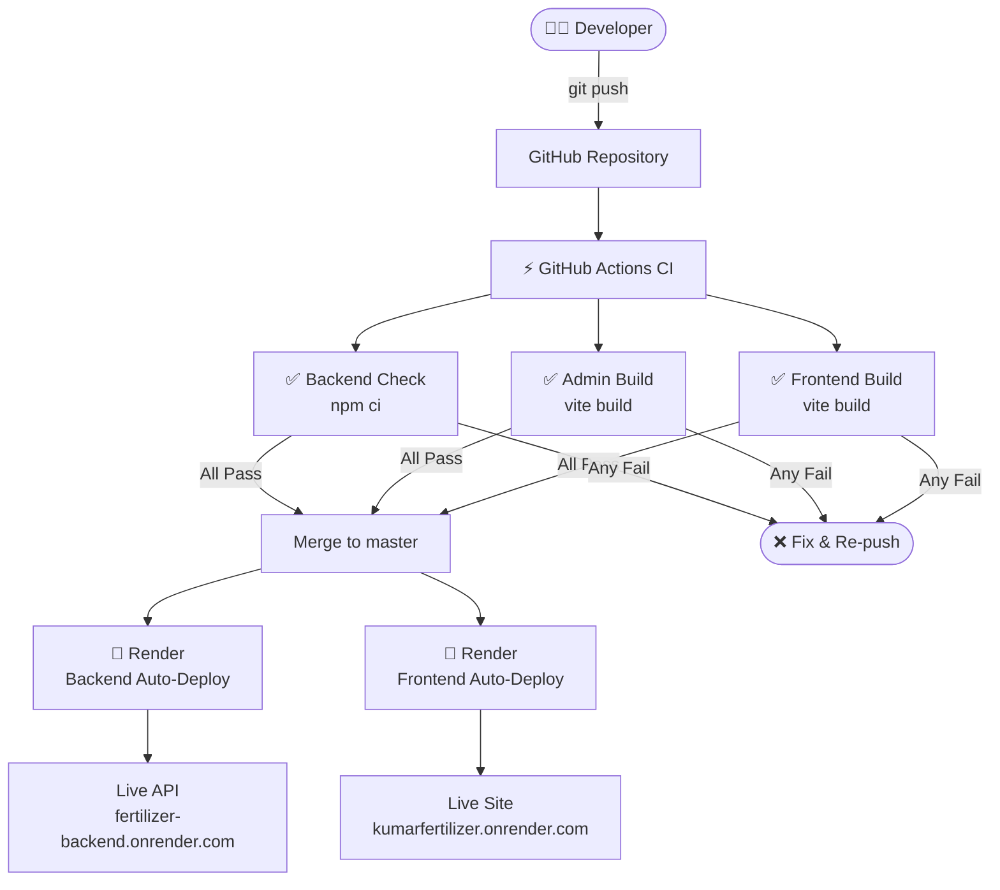
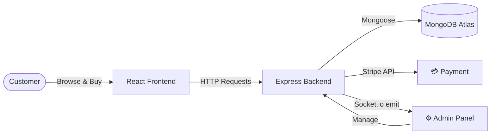

<div align="center">

# 🌱 Kumar Fertilizer Shop

**Full-stack MERN e-commerce — farmer ke liye online khad ki dukaan**

[](https://github.com/priyanshuuranjan/Fertilizer-Shop-admin/actions/workflows/ci.yml)


**[🛒 Customer Site](https://kumarfertilizer.onrender.com)** · **[⚙️ Admin Panel](https://fertilizer-admin.onrender.com)** · **[🐛 Report Bug](https://github.com/priyanshuuranjan/Fertilizer-Shop-admin/issues)**

</div>

---

## 🔄 How It Works — Complete Workflow





---

## 🏗️ Architecture — 3 Independent Apps

| App | Tech | URL |
|-----|------|-----|
| 🛒 **Customer Frontend** | React 18 + Vite | `frontend/` |
| ⚙️ **Admin Panel** | React 18 + Vite | `admin/` |
| 🖥️ **Backend API** | Node.js + Express | `backend/` |

---

## ✨ Features

<details>
<summary><b>⚙️ Admin Panel</b></summary>

| Feature | Details |
|---------|---------|
| 📊 **Dashboard** | Revenue cards + 7-day bar chart (Recharts) + recent orders |
| 📦 **Products** | Add with image upload · Bulk-select & delete · Stock tracking |
| 🛍️ **Orders** | Status management · **CSV Export** one-click |
| 👥 **Customers** | Order count & total spent · Search & sort |
| 🎟️ **Promo Codes** | Create · validate · auto-burn after use |
| 🔔 **Notifications** | Real-time bell badge via Socket.io — new orders ping instantly |
| 🌙 **Dark / Light Mode** | Persisted in localStorage |
| 📱 **Responsive** | Mobile sidebar → horizontal nav |

</details>

<details>
<summary><b>🛒 Customer Frontend</b></summary>

- Product browsing with category filters
- JWT auth — register / login
- Cart with live totals
- Promo code at checkout
- Stripe payment gateway
- Order history + status tracking
- Skeleton loaders on every async screen

</details>

<details>
<summary><b>🖥️ Backend API</b></summary>

- RESTful Express API
- JWT stateless authentication
- Rate limiting — 200 req / 15 min per IP
- Request logging — Morgan + Winston → `logs/`
- Centralized error handler
- Socket.io — real-time order events
- Multer — product image uploads
- Stripe checkout + payment verify

</details>

---

## 🛠️ Tech Stack

### Backend
| | Technology | Why |
|--|-----------|-----|
| 🟢 | **Node.js v20** | Same JS language across stack, fast non-blocking I/O |
| ⚡ | **Express.js** | Clean routing + middleware chaining |
| 🍃 | **MongoDB + Mongoose** | Flexible NoSQL schema for products/orders |
| 🔑 | **JWT** | Stateless auth — perfect for load balancing |
| 🔒 | **Bcrypt** | One-way password hashing — safe even on DB leak |
| 💳 | **Stripe** | PCI-compliant payments, no card data stored |
| 🔌 | **Socket.io** | WebSocket real-time bi-directional events |
| 📁 | **Multer** | Multipart file uploads |
| 🚦 | **express-rate-limit** | DDoS & brute-force protection |
| 📋 | **Morgan + Winston** | HTTP logs + structured file logging |

### Frontend & Admin
| | Technology | Why |
|--|-----------|-----|
| ⚛️ | **React 18** | Component UI, Virtual DOM, industry standard |
| ⚡ | **Vite 6** | 10× faster than CRA, instant HMR |
| 📊 | **Recharts** | Composable charts for dashboard |
| 🔗 | **React Router v6** | SPA client-side routing |
| 📡 | **Axios** | HTTP client with interceptors |
| 🔌 | **Socket.io-client** | Real-time order notifications |

### DevOps
| | Tool | Role |
|--|------|------|
| 🔄 | **GitHub Actions** | CI — auto build-check on every push |
| 🚀 | **Render.com** | CD — auto-deploy on master merge |
| ⚡ | **PM2** | Load balancer — cluster mode, all CPU cores |
| 🍃 | **MongoDB Atlas** | Managed cloud database, auto-backups |

---

## 📂 Project Structure

```
Fertilizer-Shop-admin/
│
├── backend/
│   ├── server.js               ← Entry point (HTTP + Socket.io)
│   ├── config/db.js            ← MongoDB connection
│   ├── controllers/            ← Business logic
│   │   ├── dashboardController.js
│   │   ├── customerController.js
│   │   ├── orderController.js  ← CSV export included
│   │   └── productController.js ← Bulk remove included
│   ├── middleware/
│   │   ├── auth.js             ← JWT verify
│   │   ├── rateLimiter.js      ← 200 req/15min
│   │   ├── logger.js           ← Morgan + Winston
│   │   └── errorHandler.js     ← Centralized errors
│   ├── models/                 ← Mongoose schemas
│   └── routes/                 ← Express routers
│
├── admin/src/
│   ├── pages/Dashboard/        ← Stats + Recharts bar chart
│   ├── pages/Customers/        ← User table with search
│   ├── pages/List/             ← Bulk delete checkboxes
│   ├── pages/Orders/           ← Status + CSV export
│   ├── components/Navbar/      ← Bell notification
│   └── components/Sidebar/     ← All nav links
│
├── frontend/                   ← Customer storefront
├── .github/workflows/ci.yml    ← GitHub Actions CI
└── ecosystem.config.cjs        ← PM2 cluster config
```

---

## 🚀 Getting Started

### Prerequisites
- Node.js v18+
- MongoDB Atlas account
- Stripe account (test keys)

### Setup

```bash
# 1. Clone
git clone https://github.com/priyanshuuranjan/Fertilizer-Shop-admin.git
cd Fertilizer-Shop-admin

# 2. Create .env files (see Environment Variables below)

# 3. Run all three — each in a separate terminal
cd backend  && npm install && npm run server   # → localhost:8000
cd frontend && npm install && npm run dev      # → localhost:5173
cd admin    && npm install && npm run dev      # → localhost:5174
```

---

## 🔐 Environment Variables

> ⚠️ Never commit `.env` files — they are git-ignored.

**`backend/.env`**
```env
PORT=8000
MONGODB_URL=mongodb+srv://<user>:<pass>@<cluster>/<db>
JWT_SECRET=your_random_secret
STRIPE_SECRET_KEY=sk_test_xxxx
FRONTEND_URL=http://localhost:5173
ADMIN_EMAIL=admin@yourshop.com
ADMIN_PASSWORD=SecurePassword
```

**`frontend/.env` & `admin/.env`**
```env
VITE_API_URL=http://localhost:8000
```

---

## 🔌 API Reference

Base URL: `http://localhost:8000`

### Products
| Method | Endpoint | Description |
|--------|----------|-------------|
| `GET` | `/api/product/list` | All products |
| `POST` | `/api/product/add` | Add product (multipart/form-data) |
| `POST` | `/api/product/remove` | Delete one `{ id }` |
| `POST` | `/api/product/bulk-remove` | Delete many `{ ids: [] }` |

### Orders
| Method | Endpoint | Auth | Description |
|--------|----------|------|-------------|
| `POST` | `/api/order/place` | ✅ JWT | Place order + Stripe session |
| `POST` | `/api/order/verify` | — | Confirm Stripe payment |
| `GET` | `/api/order/list` | — | All orders (admin) |
| `POST` | `/api/order/status` | — | Update order status |
| `GET` | `/api/order/export` | — | Download orders as CSV |

### Users & Cart
| Method | Endpoint | Description |
|--------|----------|-------------|
| `POST` | `/api/user/register` | Register → JWT |
| `POST` | `/api/user/login` | Login → JWT |
| `POST` | `/api/cart/add` | Add to cart (JWT) |
| `POST` | `/api/cart/get` | Get cart (JWT) |

### Dashboard & Customers
| Method | Endpoint | Description |
|--------|----------|-------------|
| `GET` | `/api/dashboard/stats` | Revenue, orders, users, 7-day chart |
| `GET` | `/api/customers/list` | Users + order count + total spent |
| `POST` | `/api/admin/login` | Admin JWT token |

---

## ⚡ Load Balancing — PM2

```bash
npm install -g pm2
pm2 start ecosystem.config.cjs   # Cluster mode — all CPU cores
pm2 status                        # View processes
pm2 reload all                    # Zero-downtime redeploy
pm2 save && pm2 startup           # Auto-start on server reboot
```

---

## 🌐 Deployment — Render.com

### Backend (Web Service)
```
Root Dir:      backend
Build:         npm install
Start:         node server.js
Auto-Deploy:   ✅ from master
```
Add all `backend/.env` variables in Render's **Environment** tab.

### Admin / Frontend (Static Site)
```
Root Dir:      admin  (or frontend)
Build:         npm install && npm run build
Publish Dir:   dist
Auto-Deploy:   ✅ from master
Env:           VITE_API_URL = https://your-backend.onrender.com
```

> 💡 Free tier sleeps after 15 min idle (~30s cold start). Use [UptimeRobot](https://uptimerobot.com) to ping every 5 min — keeps it warm for free.

---

## 📄 License

MIT — see [LICENSE](LICENSE)

---

<div align="center">

Built with ❤️ by **[Priyanshu Ranjan](https://github.com/priyanshuuranjan)**

</div>
